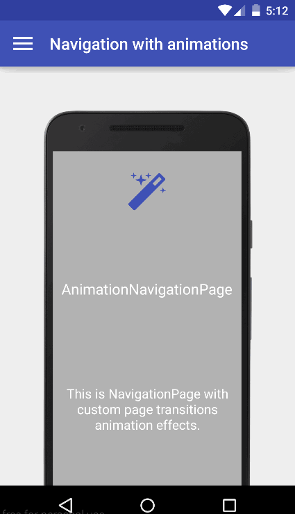
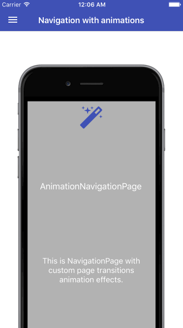

# Animation Navigation Page
## Get 50% on [Animation Navigation Page](https://components.xamarin.com/view/customnavpage)! PromoCode: DISC-FirstName-LastName-nrpikAN
Override the default Page Transitions for Xamarin.Forms when calling PushAsync and PopAsync.

 

##Features
- Set Animation Duration.
- Select Animation type (Empty, Push, Fade, Flip, Slide, Roll, Rotate).
- Select Animation Subtype (Default, FromLeft, FromRight, FromTop, FromBottom).

##Links
- [Xamarin Components Store](https://components.xamarin.com/view/customnavpage)
- [YouTube Demo](https://youtu.be/Re48wHf_7yU)

## Support platforms

- [x] Android
- [x] iOS
- [ ] WP (Coming Soon)

## Usage
The simplest example of using AnimationNavigationPage looks something like this:

- Create AnimationNavigationPage
```csharp  
public class App : Application
{
        public App()
        {
            MainPage = new AnimationNavigationPage(new YourHomePage());
        }
}
```
- Create AnimationPage instead ContentPage and create instance of FadePageAnimation or PushPageAnimation or FlipPageAnimation etc in xaml or bind from ViewModel.
```csharp   
<?xml version="1.0" encoding="UTF-8"?>
<controls:AnimationPage xmlns="http://xamarin.com/schemas/2014/forms"
        xmlns:x="http://schemas.microsoft.com/winfx/2009/xaml"
        xmlns:controls="clr-namespace:FormsControls.Base;assembly=FormsControls.Base"
        x:Class="Sample.FadeAnimationPage"
        Title="Fade Animation">
        <controls:AnimationPage.PageAnimation>
            <controls:FadePageAnimation />
        </controls:AnimationPage.PageAnimation>
</controls:AnimationPage>
```
- Or implement interface IAnimationPage for ContentPage. Create instance of EmptyPageAnimation or DefaultPageAnimation or FlipPageAnimation etc... 
```csharp   
public partial class FirstPage : ContentPage, IAnimationPage
{
        public FirstPage()
        {
            InitializeComponent();
        }
    
        public IPageAnimation PageAnimation { get; } = new FlipPageAnimation { Duration = 650, Subtype = AnimationSubtype.FromLeft }; 
}
```

##Changes
**New in 1.5.0**

- New animation types (Roll and Rotate).
- Support FormsAppCompatActivity for Android (limitation not supported Flip animation and changing animation duration. This features will be implemented on next versions).

**New in 1.2.4**

- Optimize animation for iOS and Android.

**New in 1.2.3**

- New animation for Android (Push).
- New animation for iOS (Fade).

**New in 1.2.2**

- Optimize package size.
- Improve performance.

**New in 1.2.1**

- Implement "Swipe to go back" gesture for iOS.
